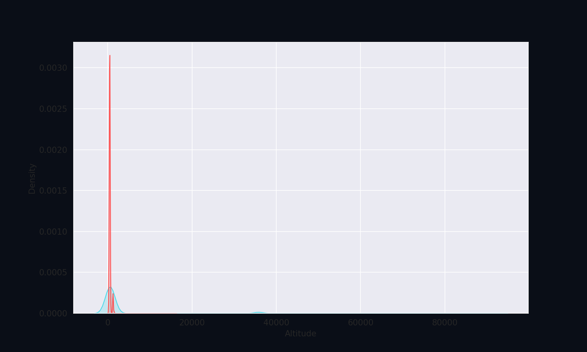

# Satellite Health Monitor



A machine learning pipeline that predicts satellite orbital decay risk using live Two-Line Element (TLE) data. The model pulls real-time orbital data for active satellites, engineers physics-based features, and trains an XGBoost classifier to flag satellites that may be at risk of atmospheric re-entry / decay in the near term.

## How It Works

1. **Fetch live TLE data** — Pulls current TLE sets for all active satellites from [Celestrak](https://celestrak.org).
2. **Parse orbital elements** — Uses the `sgp4` library to parse each TLE into orbital parameters (eccentricity, inclination, mean motion, bstar drag term, epoch).
3. **Engineer features** — Derives semi-major axis and orbital altitude from mean motion using standard orbital mechanics.
4. **Label risk** — Flags a satellite as "at risk" based on a bstar (drag coefficient) threshold, used as a proxy for elevated atmospheric drag.
5. **Train a model** — Trains an XGBoost classifier (via an sklearn `Pipeline` with `StandardScaler` preprocessing) on the engineered features to predict decay risk.
6. **Evaluate** — Reports ROC AUC, classification report, and confusion matrix on a held-out test set.
7. **Query any satellite** — Provides a lookup function/tool to check the predicted decay risk for any named satellite in the current TLE dataset.

## 📊 Analysis


## Requirements

```bash
pip install requests pandas numpy sgp4 scikit-learn xgboost
```

This notebook is designed to run in Google Colab, but will run in any standard Jupyter environment with the above dependencies installed.

## Usage

Run the notebook cells in order:

1. **Fetch data** — Downloads the latest active satellite TLE data from Celestrak.
2. **Look up a single satellite (optional)** — Verify a satellite's TLE is present by name (e.g. `"CALSPHERE 1"`).
3. **Parse all satellites** — Converts raw TLE lines into `Satrec` objects for every satellite in the dataset.
4. **Build the feature dataframe** — Extracts bstar, eccentricity, inclination, mean motion, and epoch for each satellite.
5. **Engineer orbital features** — Computes semi-major axis and altitude, then labels satellites as "at risk" based on the bstar threshold.
6. **Split the data** — Creates train (60%), validation (20%), and test (20%) sets.
7. **Train the model** — Fits an XGBoost classifier pipeline on the combined train + validation data.
8. **Evaluate on test set** — Prints ROC AUC score, classification report, and confusion matrix.
9. **Predict risk for a satellite** — Use `predict_satellite_decay_risk(sat_name, tle_lines, pipeline)` to get a decay risk probability for any satellite by name.
10. **Interactive lookup tool** — A Colab form widget (`target_satellite`) for quickly checking any satellite's risk status without editing code.

### Example

```python
risk_score = predict_satellite_decay_risk("CALSPHERE 1", lines, XRfor_model)
# Output:
# 📡 SATELLITE: CALSPHERE 1
# 📊 30-Day Decay Risk Probability: 12.34%
# ✅ STATUS: STABLE — Orbit shows safe structural parameters.
```

## Model Features

The classifier is trained on the following orbital parameters:

| Feature | Description |
|---|---|
| Eccentricity | Shape of the orbit (0 = circular) |
| Inclination | Orbital plane angle relative to the equator (radians) |
| Mean Motion | Revolutions per day (rad/min, SGP4 units) |
| Epoch | Timestamp of the TLE observation (Julian date) |
| Altitude | Derived orbital altitude above Earth's surface (km) |

**Target label:** `at risk` — binary flag derived from whether a satellite's bstar (drag term) exceeds a fixed threshold (`0.000463`).

## Notes & Caveats

- **Label is heuristic, not ground truth.** The "at risk" label is derived from the bstar drag coefficient alone, not from actual decay/re-entry outcomes. This is a proxy label, so model performance reflects how well the model predicts high-bstar orbits, not confirmed decay events.
- **Data is a live snapshot.** Since TLE data is fetched fresh from Celestrak on each run, results will vary run-to-run as satellites are added, removed, or updated.
- **"30-day" framing.** The risk probability is described as a "30-day decay risk" in the output messaging, but the model itself is not explicitly time-horizon calibrated — this labeling may want to be revisited or validated against real decay event data.

## Potential Improvements

- Validate the "at risk" label against actual historical decay/re-entry records instead of a fixed bstar threshold.
- Add cross-validation and hyperparameter tuning for the XGBoost model.
- Include additional orbital features (e.g. perigee/apogee, RAAN, argument of perigee).
- Persist the trained model (e.g. via `joblib`) so it doesn't need retraining on every run.
- Add unit tests around the TLE parsing and feature engineering steps.

## Data Source

Orbital data is sourced from [Celestrak](https://celestrak.org), a public repository of satellite tracking data.
